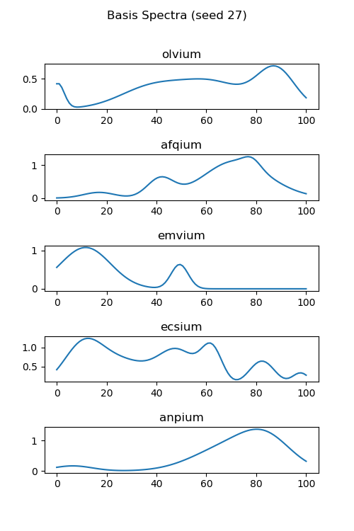
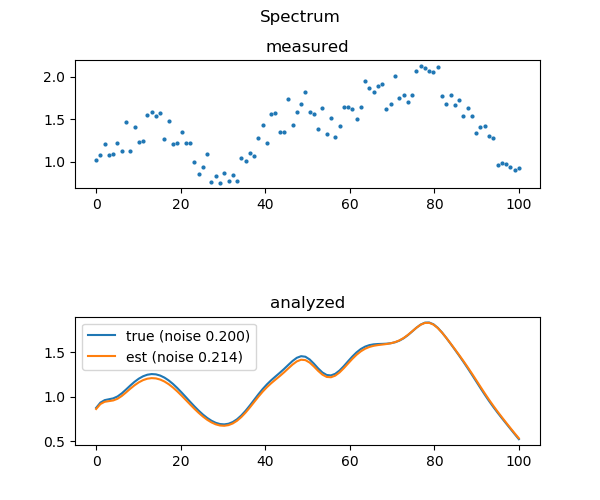

# sd: Power Spectral Decomposition Using CVXPY
Copyright (c) 2019 Bart Massey

This Python 3 code demonstrates Convex Analysis using
[CVXPY](https://www.cvxpy.org) to estimate the amplitudes of
basis spectra in a noisy measured spectrum. It was written
as a feasibility demo for an upcoming project.

The demo generates a random set of basis spectra. It then
simulates a measured spectrum comprised of the sum of random
proportions of the basis spectra and a uniform noise term.
CVXPY is used to estimate the spectral composition and noise
level of the measured spectrum. Finally, the results of the
simulation and analysis are displayed both textually and
graphically using [`matplotlib`](https://matplotlib.org):
the analysis and figures generated are also saved as `txt`
and PNG files in the current directory.

## Build and Run

Prerequisites:

* A working Python 3 installation
* `numpy`
* `cvxpy`
* `matplotlib`

It is likely that `numpy` and `matplotlib` are available in
a standard OS distro. All of the prerequisites can be
installed via `pip3 install`.

To run the program, you can just say `python3 sd.py`. Note
that each run will generate a pseudo-random number generator
seed, which can be given on the command line to repeat a
previous run. You can set the noise level (which defaults to
0). You can specify saving your analysis files to the
current directory for later use. Say `python3 sd.py --help`
for details.

## Example

Let's try it:

    python3 sd.py --seed=27 --noise=0.4

The analysis should complete quickly and print the following
text:

```
analysis (q=2.338, noise=0.428 (0.400)):
- olvium: 0.516 (0.547)
- afqium: 0.750 (0.813)
- emvium: 0.564 (0.608)
- ecsium: 0.135 (0.191)
- anpium: 0.261 (0.199)
```

Note that the basis spectra are given randomly-generated
"element names" for convenience. The numbers in parentheses
are the "true" values for which the numbers to their left
are estimates. The `q` is the least-squares error in the
approximation: it should be small.

The code should also display two figures. Figure 1 shows the
basis spectra chosen for the analysis.



Figure 2 shows the analysis: the first graph is the
simulated measurement; the second shows the true spectrum
and the estimated spectrum.



## Future Work

The handling of the noise component still doesn't seem to be
quite right. A statistician should think about it.

It would be useful to add a lambda parameter that
disproportionately penalized the objective function for
smaller basis amplitudes: this would likely improve the
estimates in the case where many basis components were just
not present (not a thing here).

Indeed, a parameter that outright constrained the number of
basis spectra used would be helpful for some kinds of
analysis. It is not clear how this would impact solver
performance, however: the obvious implementation would
require mixed-integer convex programming, which can be quite
expensive.

A better measurement model would be a good addition,
although at that point probably an analysis on real power
spectral data would be even better.

## License

This work is made available under the "MIT License". Please
see the file `LICENSE` in this distribution for license
terms.
