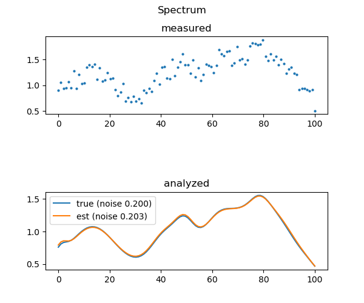

# sd: Power Spectral Decomposition Using CVXPY
Copyright (c) 2019 Bart Massey

This Python 3 code demonstrates Convex Analysis using
[CVXPY](https://www.cvxpy.org) to estimate the amplitudes of
basis spectra in a noisy measured spectrum. It was written
as a feasibility demo for an upcoming project.

The demo generates a random set of basis spectra. It then
simulates a measured spectrum comprised of the sum of random
proportions of the basis spectra and a uniform noise term.
CVXPY is used to estimate the spectral composition and noise
level of the measured spectrum. Finally, the results of the
simulation and analysis are displayed both textually and
graphically using [`matplotlib`](https://matplotlib.org):
the analysis and figures generated are also saved as `txt`
and PNG files in the current directory.

## Build and Run

Prerequisites:

* A working Python 3 installation
* `numpy`
* `cvxpy`
* `matplotlib`

It is likely that `numpy` and `matplotlib` are available in
a standard OS distro. All of the prerequisites can be
installed via `pip3 install`.

To run the program, you can just say `python3 sd.py`.

* Each run will generate a pseudo-random number generator
  seed, which can be given on the command line to repeat a
  previous run.

* You can set the noise level (default 0), the number of
  spectral samples (default 100), and the number of bases
  (default 5).

* By default, the basis prevalences (amplitudes) are
  normalized so that the largest is between 0.5 and 1.  You
  can also ask that the bases sum to exactly 1: a "complete"
  spectrum. The analysis will take this into account in its
  constraint model.

* You can set the norm used for the error computation in the
  solver. The default is to use the Linf norm: you can also
  choose the L1 norm or the always popular L2 norm.

* You can choose to use only some of the bases to form the
  spectrum, with the rest having zero prevalence. This
  "sparse" spectrum could be further optimized through
  greedy basis pursuit — see Future Work below.

* You can specify saving your analysis files to the current
  directory for later use.

Say `python3 sd.py --help` for program usage details.

## Example

Let's try it:

    python3 sd.py --seed=27 --noise=0.2

The analysis should complete quickly and print the following
text:

```
analysis (seed=27, q=0.099, noise=0.202 (0.200)):
- olvium: 0.416 (0.453)
- afqium: 0.674 (0.674)
- emvium: 0.460 (0.504)
- ecsium: 0.163 (0.158)
- anpium: 0.158 (0.165)
```

Note that the basis spectra are given randomly-generated
"element names" for convenience. The numbers in parentheses
are the "true" values for which the numbers to their left
are estimates. The `q` is the error in the approximation
using the chosen norm (default Linf, the maximum pointwise
error): it should be small.

The code should also display two figures. Figure 1 shows the
basis spectra chosen for the analysis.


Figure 2 shows the analysis: the first graph is the
simulated measurement; the second shows the true spectrum
and the estimated spectrum.



## Future Work

It would be useful to add a lambda parameter that
disproportionately penalized the objective function for
smaller basis amplitudes: this would likely improve the
estimates in the case where many basis components were just
not present (not a thing here).

Indeed, a parameter that outright constrained the number of
basis spectra used would be helpful for some kinds of
analysis. It is not clear how this would impact solver
performance, however: the obvious implementation would
require mixed-integer convex programming, which can be quite
expensive.

A better measurement model would be a good addition,
although at that point probably an analysis on real power
spectral data would be even better.

Greedy basis pursuit should be used to analyze "sparse"
spectra. This should give better prevalence figures in this
case.

## License

This work is made available under the "MIT License". Please
see the file `LICENSE` in this distribution for license
terms.
